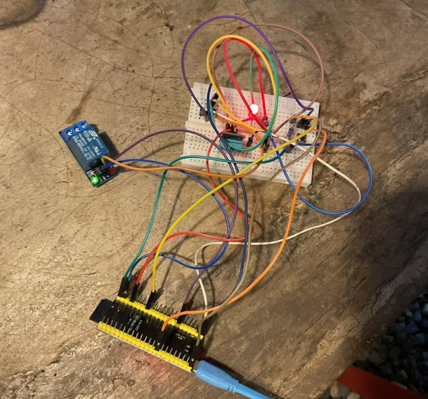
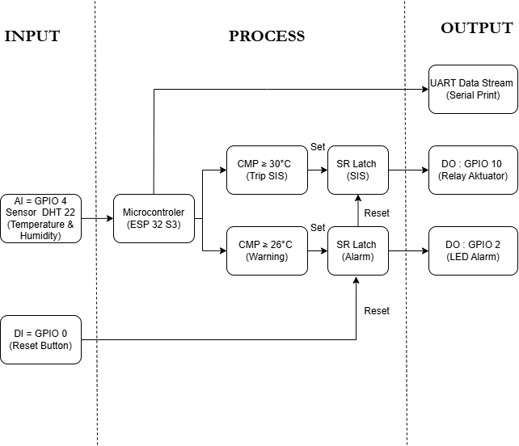
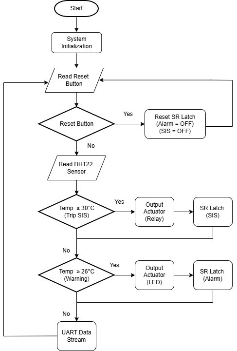
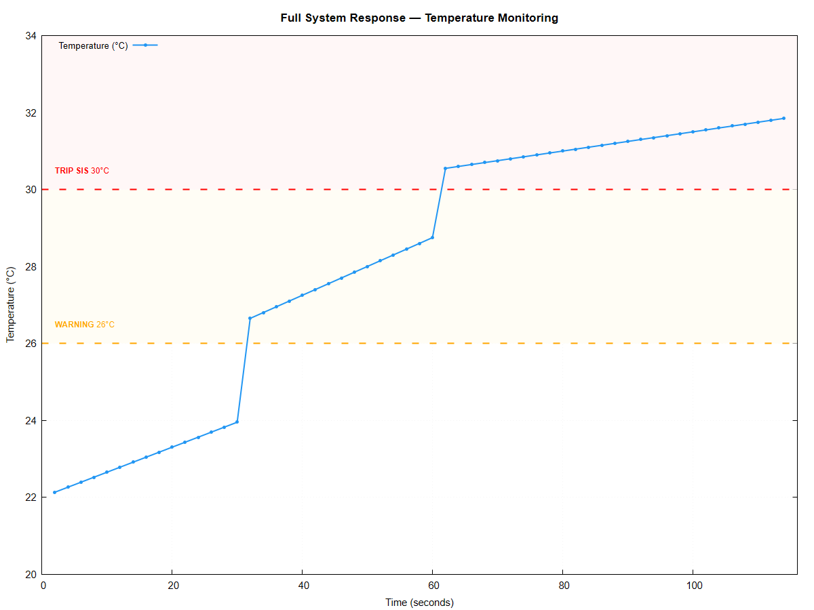
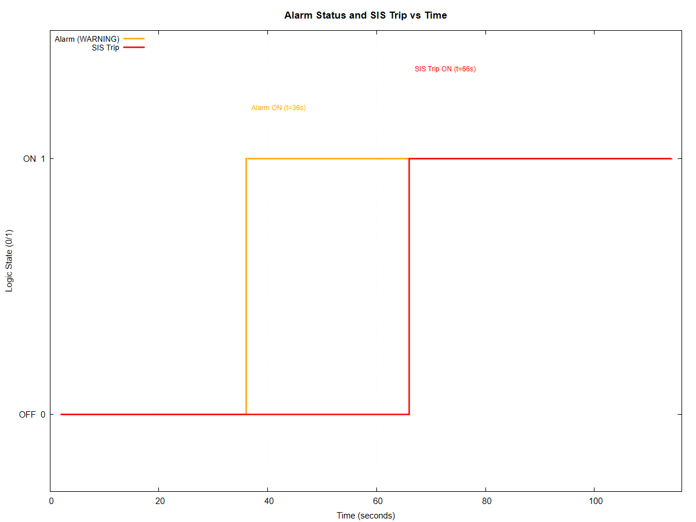
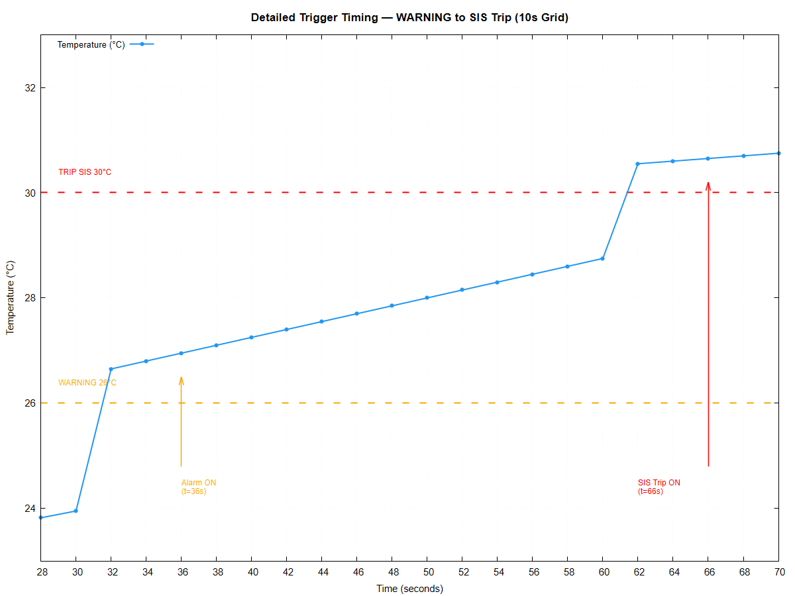
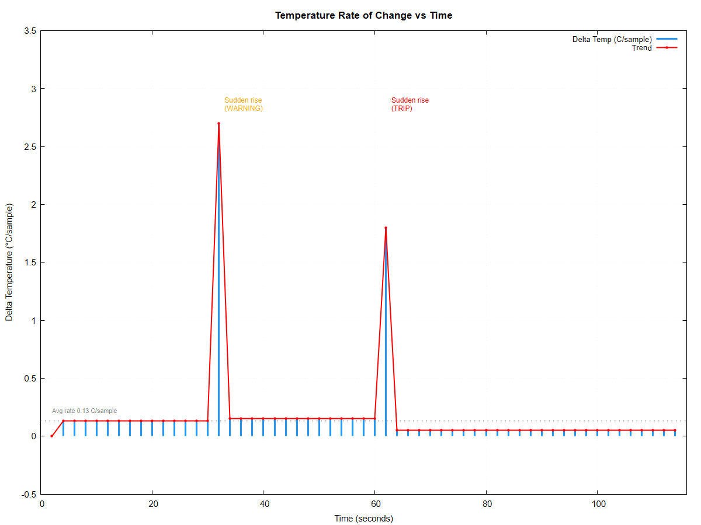

# Safety Instrumented System for X-Ray Room Environmental Monitoring

**Temperature and Humidity Latching Safety Instrumented System (THLSIS) with N-Voter Confirmation Logic Based on Rust ESP-IDF on ESP32-S3 for X-Ray Room Environmental Safety Monitoring**  


---

## Authors

| Name | NRP | Class |
|------|-----|-------|
| Aulia Putri Herawati | 2042241061 | 4C |
| Estik Fitria Trisna Riyanti | 2042241106 | 4C |

Course: Controller Programming  
Lecturer: Ahmad Radhy, S.Si., M.Si  
Institution: Institut Teknologi Sepuluh Nopember, Faculty of Vocation — Instrumentation Engineering, 2026

---

## Overview

This project implements a Safety Instrumented System (SIS) for monitoring temperature and humidity in hospital X-Ray rooms. The system uses Bare-Metal Rust on the ESP32-S3 microcontroller with a two-stage N-Voter latching safety logic and SR Latch fail-safe mechanism, developed in accordance with IEC 61508 safety philosophy.

The temperature thresholds are justified by ASHRAE Standard 170 and radiation sensor error studies (Lundström & Mattsson, 2020).

### Hardware Prototype



*ESP32-S3-DevKitC-1 connected to DHT11 sensor, relay module, LED alarm, and reset button on a BB830 breadboard.*

---

## Safety Logic Parameter

The system operates on a three-state safety model. Before any latch is activated, an N-Voter 3-of-3 confirmation is required — meaning 3 consecutive threshold-exceeding readings must occur before the system changes state. This eliminates false trips from transient sensor noise.

| State | Condition | Output |
|-------|-----------|--------|
| NORMAL | T < 26°C | All actuators OFF, counters reset |
| WARNING | 26°C ≤ T < 30°C, 3 consecutive readings | LED alarm ON |
| TRIP SIS | T ≥ 30°C, 3 consecutive readings | Relay ON + LED ON |
| TIMEOUT | No valid reading > 10 seconds | Emergency Trip SIS triggered |

Once latched, the system cannot auto-reset. A physical press of the reset button (GPIO0) is required to clear both latches and return to NORMAL state.

---

## Hardware Configuration

| Component | Pin | Description |
|-----------|-----|-------------|
| DHT11 Sensor | GPIO4 | Temperature and humidity input |
| LED Alarm | GPIO2 | Warning indicator (via 220Ω resistor) |
| Relay Module | GPIO10 | Trip SIS actuator (active LOW) |
| Reset Button | GPIO0 | SR Latch reset (internal pull-up) |

Microcontroller: ESP32-S3-DevKitC-1 — Xtensa LX7 dual-core, 240 MHz, 512 KB SRAM

---

## Block Diagram



The system receives input from the DHT11 sensor (AI = GPIO4) and the reset button (DI = GPIO0), processed by the ESP32-S3. Two comparators run in parallel: one for the Warning threshold (≥26°C) and one for the Trip SIS threshold (≥30°C). Each comparator feeds its own SR Latch. The outputs drive the LED alarm (GPIO2) and relay actuator (GPIO10), with all readings streamed via UART for monitoring.

---

## Flowchart



On each cycle, the firmware first checks the reset button. If pressed, both SR Latches are cleared. Otherwise, the DHT11 sensor is read and validated. The temperature value is compared against both thresholds and passed through the N-Voter counter logic. If a counter reaches 3, the corresponding SR Latch is set. Actuator outputs are applied and data is sent via UART before the next 2-second polling cycle begins.

---

## Project Structure

```
DHTRUST/
├── .cargo/
│   └── config.toml
├── src/
│   └── main.rs
├── figures/
│   ├── Blockdiagram.png
│   ├── Flowchart.png
│   ├── Rangkaianhardware.jpg
    ├── Simulasiwokwi.png
│   ├── grafik1_temperature.png
│   ├── grafik2_logic.png
│   ├── grafik3_trigger.png
│   └── grafik4_delta.png
├── Cargo.toml
├── build.rs
├── rust-toolchain.toml
├── data.csv
└── README.md
```

---

## Build and Flash

```bash
# Install ESP toolchain
cargo install espup && espup install
cargo install espflash

# Clone and build
git clone https://github.com/YOUR_USERNAME/THLSIS.git
cd THLSIS
cargo run --release

# Monitor serial output
espflash monitor --baud 115200
```

---

## GNUPlot Results

Data was captured from UART at 115200 baud in CSV format and plotted using GNUPlot 6.0. Test scenario: temperature ramp from 22°C to 32°C to verify N-Voter latching logic behavior.

### 1. Full System Response — Temperature vs Time



Temperature trace showing three distinct phases: NORMAL (22–24°C), WARNING zone (26–30°C), and TRIP zone (>30°C). Threshold lines are marked at 26°C (orange dashed) and 30°C (red dashed).

---

### 2. Alarm Status and SIS Trip vs Time



Digital step graph showing Alarm (WARNING) activation at t=36s and SIS Trip activation at t=66s. Both signals remain latched ON until end of recording, confirming true fail-safe SR Latch behavior.

---

### 3. Detailed Trigger Timing — WARNING to SIS Trip



Zoom-in view from t=28s to t=70s showing the N-Voter confirmation delay between temperature threshold crossing and SR Latch activation. The 6-second gap between crossing and latch is clearly visible for both stages.

---

### 4. Temperature Rate of Change vs Time



Delta temperature per sample showing two rapid rise events: at t=32s (WARNING zone entry, ΔT=2.70°C/sample) and at t=62s (TRIP zone entry, ΔT=1.80°C/sample), with a stable 0.13°C/sample baseline rate during gradual ramp.

---

## Simulation Results

| Event | Sample | Time |
|-------|--------|------|
| WARNING activated | 18 | t = 36s |
| TRIP SIS activated | 33 | t = 66s |
| False trips observed | — | None |

- Polling interval: 2000 ms (fixed)
- N-Voter confirmation delay: 6 seconds minimum before latch activation
- Flash footprint: ~200 KB | RAM usage: < 20 KB

---

## Dependencies

| Crate | Version | Purpose |
|-------|---------|---------|
| esp-idf-svc | 0.52.1 | GPIO and HAL abstraction for ESP32-S3 |
| log / EspLogger | — | UART structured logging at 115200 baud |
| anyhow | — | Error propagation without panic |
| embuild | — | ESP-IDF build-time toolchain integration |

---

## Literature Base

This method synthesizes 16 future work items from Scopus/WoS indexed journals published between 2021 and 2026, covering the following topics:

- Controller technology and development
- Microcontroller fundamentals and architecture
- Embedded programming in Rust (memory safety, static allocation)
- Safety-critical systems aligned with IEC 61508
- Radiological environment monitoring

Key references: Moradiyan & Sedaghat (2026), Lozano et al. (2026), Shang et al. (2026), Carnelos et al. (2025), Lundström & Mattsson (2020), Onu & Nzotta (2024). Full reference list is available in the project report.

---

## Future Work

- Integration of a real DHT11 Rust driver to replace the current simulation function
- Humidity threshold monitoring as a second independent safety parameter
- Wireless MQTT alerting for remote operator notification
- Formal evaluation against IEC 61508 SIL 1 requirements for radiological facilities

---

## Closing

This project was developed as a Midterm Exam submission for the Controller Programming course at Institut Teknologi Sepuluh Nopember, 2026. The THLSIS system demonstrates that modern embedded Rust, combined with N-Voter confirmation logic and SR Latch fail-safe behavior, provides a reliable and low-cost solution for environmental safety monitoring in radiological facilities.

---

*Institut Teknologi Sepuluh Nopember — Faculty of Vocation — Instrumentation Engineering — 2026*
